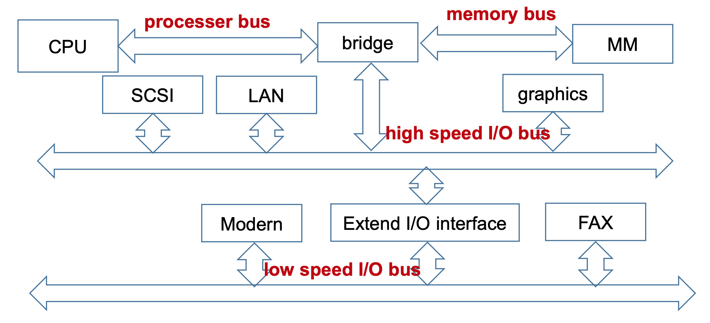

# Bus 總線

## Category 分類

### 1. Chip Inner Bus 芯片內部總線
- 連接芯片內部(CPU 內部)各部件
- CPU 內部部件：Control Unit, ALU, Register

### 2. System Bus 系統總線
- 連接系統各部件
- 系統各部件：CPU, Memory, I/O Controller, 其他

### 3. Communication Bus 通信總線
- 聯繫主機(host)其他 I/O 設備，或是用於聯繫多個計算機系統


## Component 組成

### 1. Data Lines 數據線
- 傳遞數據
- 數據線的數量決定一次能傳多少位

### 2. Address Lines 地址線
- 決定數據的目標位置或來源位置，或是 I/O 的接口
- 地址線的數量決定可訪問的地址空間大小

### 3. Control Lines 控制線
- 控制地址線和數據線的訪問與使用方式
1. Clock 時鐘信號：使總線同步
2. Bus Request 總線請求信號：設備發送請求總線信號("我要傳數據/地址了")
3. Bus Grant 總線授權信號：允許請求設備使用總線("可以傳數據/地址了")
4. Interrupt Request 中斷請求信號：請求中斷("我要中斷了")
5. Interrupt Adknowledge 中斷識別信號：允許中斷("可以中斷了")
6. Memory Read 讀內存：從內存讀數據到總線(Memory -> Bus)
7. Memory Write 寫內存：存總線寫數據到內存(Bus -> Memory)
8. I/O Read I/O讀：從 I/O 端口向總線讀取數據(I/O -> Bus)
9. I/O Write I/O寫：從總線往 I/O端口寫數據(Bus -> I/O)


## 1. Type 依線路使用方式分類
1. Dedicated 專用總線
2. Multiplexed 多路複用總線

### 1. Dedicated 專用總線
- 永遠執行相同功能或有線功能循環
- 優點：高吞吐量、總線衝突少
- 缺點：增加規模與成本

### 2. Multiplexed 多路複用總線
- 同一條總線有多種不同用途
- 優點：線的總數變少，減少成本並降低規模
- 缺點：每個模塊需要更複雜的電路才能識別總線信號(握手制度)，並且可能因為共享降低性能

## 2. Arbitration 依仲裁方式分類
- 總線可以監聽多個設備的請求，但使一次只能有一個設備傳輸據
- Arbitration 仲裁：當多個設備同時請求使用時，使用某種策略決定先後順序
- 策略因素：
1. Priority 優先級：高優先級能更快處理
2. Fairness 公平：低優先級不會延遲太久

### 0. Type 類型
1. Centralized 集中式
2. Distributed 分布式

### 1. Centralized 集中式
- 有一個中央設備負責處理仲裁
1. Daisy Chain 菊花鏈拓墣網絡：簡單來說就是環形電路
2. Query By Counter 計數器查詢：???
3. Independtly Request 獨立請求：每個設備獨立向中央仲裁發送請求

#### Daisy Chain 菊花鏈拓墣網路(By Priority)
- 中央仲裁器發送`准許信號(grant)`，由優先級最高的設備接受並將`總線設置為忙碌(busy)`並截斷 grant 信號，直到使用完畢後發送 grant 到低優先級的設備
- Grant 准許信號：由高優先級設備向低優先級設備
- Busy 忙碌 / Request 請求線：中央仲裁器與所有設備互聯，告知目前總線請求狀態


##### 優點
1. 決定優先級簡單(誰在前面誰就優先)
2. 增加設備簡單

##### 缺點
1. 不能保證公平性(總是高優先級先處理)
2. 對線路錯誤敏感(Grant, Busy 信號的擾亂)
3. `限制了總線的速度(成為性能瓶頸)`

#### Query By Counter 計數器查詢(By Device ID)
- 使用`設備編號(Device ID)`取代優先級，中央仲裁器發送設備編號決定誰能使用總線
- Remove Grant Add Device ID Lines


##### 優點
1. 優先級設置更有彈性(調整設備編號)
2. Device ID 由中央仲裁器統一發送，不會出現個別線路錯誤敏感問題

##### 缺點
1. 增加設備編號線
2. 需要解碼並比較設備編號(每次訪問都多一步檢查將影響性能)

#### Independtly Request 獨立請求
- 每個設備獨立向中央仲裁器發送請求，優中央仲裁器邏輯控制誰能使用總線
- 需要選擇策略(LRU, LFU, FIFO)


##### 優點
1. 響應快速
2. 優先級動態決定，可編程

##### 缺點
1. 更複雜的邏輯電路
2. 更多控制線

### 2. Distributed 分布式
- 每個設備都有一個訪問控制邏輯，多個設備同步來共享總線
1. Self Selection 自我選擇
2. Collision Detection 碰撞檢測

#### 1. Self Selection 自我選擇
- Fixed Priority 優先級固定
- 每個設備都向總線發送請求，各自分別辨識自己是否為當前優先級最高的設備(最低的設備沒有，只有當 Busy 為否才輪到最低優先級的設備)


#### 2. Collision Detection 碰撞檢測
1. 每個設備在使用前先檢測總線是否忙碌(Busy)

2. 不忙碌直接使用，傳輸數據同時監聽總線數據

3. 若發現總線數據碰撞，則所有設備終止傳輸，並在隨機時間後重新檢查 Busy 位

## 3. Timing 依時序分類
- 請求於總線的協調方式(事件出現的決定方式)
1. Synchronous 同步：事件的發生由時鐘週期決定
2. Asynchronous 異步：事件的發生取決於前一個事件
3. Semi-Synchronous 半同步：同步異步混合
4. Split Transaction 拆分事務：當設備準備好數據時才釋放總線

### 1. Synchronous 同步
- 總線處理順序：地址 -> 數據 -> 數據 -> ... -> 數據結束 -> 地址


#### 優劣
- 優點：實現簡單而且檢查簡單
- 缺點
1. 多個設備共用一個時鐘信號，易阻塞，造成性能瓶頸
2. 為避免出現`時鐘偏斜(clock skew)`需限制總線長度

##### Clock Skew 時鐘偏斜
- 太長的總線不同段收到的時鐘信號會出現延遲

### 2. Asynchronous 異步
- 總線處理順序：Address -> Data -> Data
- 使用握手協議


- Example


#### 優劣
- 優點：可適應不同速度的設備
- 缺點
1. 噪聲影響大(握手途中受干擾)
2. 複雜的內部邏輯

### 3. Semi-Synchronous 半同步
- 為了降低噪聲(noise)對握手機制的影響，在異步的基礎上加上同步時鐘週期(只在上升沿動作)


### 4. Split Transaction 拆分事務
- 將一次請求分成兩階段(或更多)執行


#### 優劣
- 優點：增加總線使用率(減少等待數據的閒置時間)
- 缺點：增加系統複雜度，而且大大降低每個事務的響應速度(需要等待總線控制權回來)

## 4. Others Effect 其他影響因素
1. Bus BandWidth 總線寬度：不考慮仲裁方式和地址轉移
2. Data Transfer Rate 數據傳輸率：考慮地址轉移
3. Bus Hierarchy 總線等級制度：Single, Double, Multiple
4. Bus Width 總線寬度(線的數量)：寬度越寬，一次能傳更多位，也能尋找更大的地址空間

### 1. Data Transfer Rate 數據傳輸率
-  每次數據傳輸時間計算
```
數據準備時間 M
-------------------------------------------------
>>> 同步總線：時鐘週期為 T
1. CPU 命令跟地址 -> Memory：一次時鐘週期 T
2. 數據準備(Memory 將數據放上數據線的時間)：M
3. CPU 從數據線讀取數據：T

總時間 Ts =  T + M + T
-------------------------------------------------
>>> 異步總線：握手時間 S
1. CPU 設置 ReadReq -> Memory 設置 Ack：一次握手 S
2. 釋放 Ack, ReadReq, Address 到傳送 Data：共三次握手
3. Memory 準備數據並放到數據線上：M(與第二步同步進行)
4. CPU 讀取數據，Memory 確認交付數據並清空總線：三次握手 S

總時間 Ta = S + max(M, 3S) + 3S
```


- Example
```
條件：
同步總線時鐘週期 50 ns
異步總線每次握手 40 ns
數據線寬度均為 32 bits
存儲器數據準備時間 230 ns

讀一個字時的數據傳輸率
V = B / T
B 傳送數據總量(bit)
T 耗費時間(s)
-------------------------------------------------
>>> 同步總線
Ta = T + ceil(M) + T
   = 50 + 250 + 50
Vs = 32 bits / (50 + 250 + 50) 
   = 91.4 Mbps (Million bits per second)

* 數據準備時間需與時鐘週期對齊，即 230 ns 需要五個時鐘週期 = 250 ns
-------------------------------------------------
>>> 異步總線
Ta = S + max(M, 3S) + 3S
   = 40 + max(120, 230) + 120
Va = 32 bits / (40 + 230 + 120) 
   = 82.1 Mbps

```

#### Different Data Block Size 不同的數據塊大小
1. 計算總線週期(Cmd + Address)
2. 計算數據傳輸時間(由總線傳輸速率求得)
3. 加上閒置時間
4. 詳情看作業題

### 2. BandWidth of Synchronous Bus 增加同步總線帶寬方式
- Increase Clock Frequency 增加時鐘頻率：單位時間傳更多次
- Increase Data Bus Width 增加數據線寬度：一次傳更多數據
- Bolck Transfer 塊傳輸：一次傳地址配多次傳數據
- Split Bus Transaction 拆分事務：可增加系統帶寬
- Separate Address & Data Line 地址線與數據線分離：可同步傳輸地址與數據

### 3. Bus Hierarchy 總線等級制度

#### 1. Single Bus Hierarchy 單總線結構
- CPU, Memory, I/O 模塊都連接到同一條總線上(System Bus 系統總線)


##### 優劣
- 優點：簡單，容易擴展(接上去就好了)
- 缺點：總線將成為系統性能瓶頸(每個模塊都要用)

#### 2. Double Bus Hierarchy 雙總線結構

##### Example 1
- 在 CPU 跟 Memory 中間多一條總線
- 優點：加快處理器與存儲器間的交互，並且降低系統總線的負擔


##### Example 2
- 透過 IOP(Input/Output Processer)模塊連接系統總線跟內存總線
- 優點：降低 I/O 總線的負擔


#### 3. Multiple Bus Hierarchy 多總線結構

##### Example 1
- 添加 DMA(Direct Access Memory) 總線：使 I/O 模塊可直接訪問內存
- 優點：增加 I/O 效率


##### Example 2
- 本地總線：CPU <-> Cache
- 內存總線：Memory <-> Cache <-> I/O Interface
- I/O 總線：其他 I/O 設備，靠 I/O 擴展接口與地址總線交互
- 優點：I/O 與 CPU 分離


##### Example 3
- 在將 I/O 模塊劃分為高速與低速兩種

